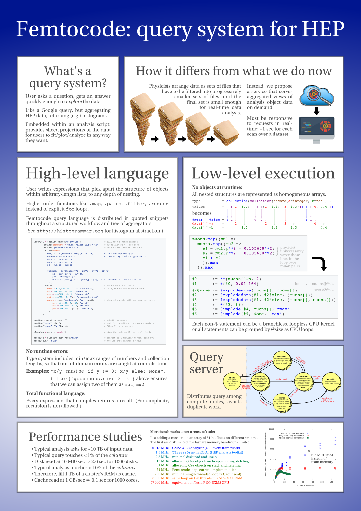

# HEPQuery

HEPQuery is a project to provide a fast, query-engine style interface to High Energy Physics (HEP) data. It's related to

   * [Femtocode](https://github.com/diana-hep/femtocode) query language*
   * [PLUR](https://github.com/diana-hep/plur) data representation

(* The Femtocode project is on hold while we develop the data representation and use [Numba-compiled Python](http://numba.pydata.org/) as a query language. Data representation should be independent of language for modularity.)

Here is an old poster describing the motivation and feasibility studies.

[Revision 203 of PLUR](https://github.com/diana-hep/plur/releases/tag/rev203)

